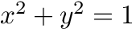

<div align="center">
  <div align="center">
    <h1><b> LaTeX To Image</b></h1>
  </div>
  <a href="">=3.6,<3.12-aff.svg"></a>
  <a href=""></a>
  <a href="https://pypi.org/project/latex-to-image/"></a>
  <a href="https://pepy.tech/project/latex-to-image"></a>
  <a href="https://semver.org/"></a>
  <a href="https://github.com/psf/black"></a>
  <a href="https://github.com/SWHL/latex_to_image/blob/3aa9c53d43281e1527271da023440b8fa95a8dbf/LICENSE"></a>

[简体中文](./docs/README_zh.md) | English
</div>

### Introduction
This tool is used to convert LaTeX formulas into corresponding images with the help of LaTeX tools.

### Install LaTeX compile environment
Ubuntu:
```bash
sudo apt-get install texlive-full

# verify whether the installation is successful.
$ xelatex --help
# Usage: pdftex [OPTION]... [TEXNAME[.tex]] [COMMANDS]
#  or: pdftex [OPTION]... \FIRST-LINE
#  or: pdftex [OPTION]... &FMT ARGS
    # Run pdfTeX on TEXNAME, usually creating TEXNAME.pdf.
```

MacOS

Recommend to install [MacTex](https://tug.org/mactex/mactex-download.html)

```bash
# verify whether the installation is successful.
$ xelatex --help
# Usage: xetex [OPTION]... [TEXNAME[.tex]] [COMMANDS]
#    or: xetex [OPTION]... \FIRST-LINE
#    or: xetex [OPTION]... &FMT ARGS
#   Run XeTeX on TEXNAME, usually creating TEXNAME.pdf.
```

### Installation
```bash
pip install latex_to_image
```

### CLI
```bash
$ latex_to_image "x^2+y^2=1" res.png
```

### Python
```python
import cv2
from latex_to_image import LaTeXToImg

render = LaTeXToImg()

formula = "x^2 + y ^2 = 1"
img = render(formula)
cv2.imwrite("res.png", img)
```

### Result
<div align="center">
    
</div>

### Reference
- [LaTeX-OCR](https://github.com/lukas-blecher/LaTeX-OCR/blob/main/pix2tex/dataset/latex2png.py)
